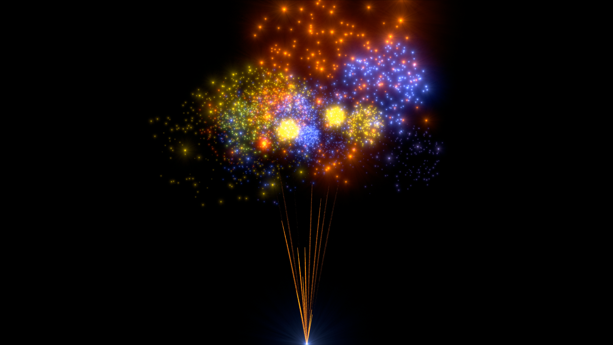

# Fireworks renderer
an elaborate algorithm to render AND simulate millions of unnecessarily detailed flares which try to mimic artifacts which only appear in the eye when looking at bright spots on the GPU using webGPU vertex, fragment and compute shaders. The result is encoded into an mp4 using ffmpeg. download output.mp4 to view the current state of the simulation.
## screenshot
